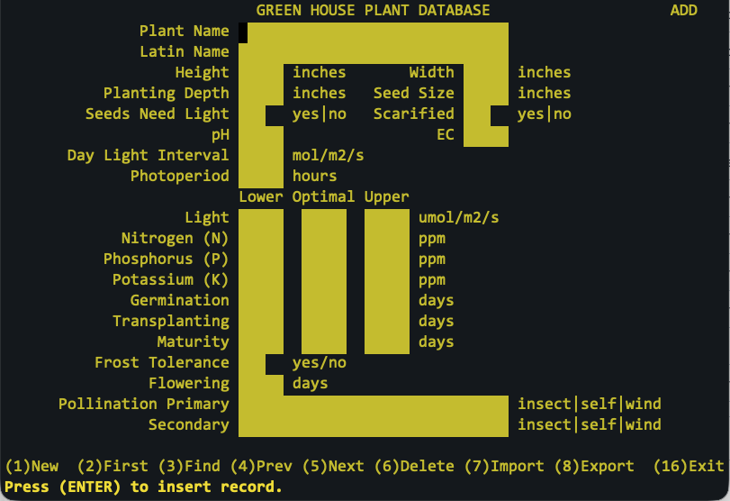

# ghdb
Green House Database
## Introduction
This is a ncurses (terminal screen) and GDBM (database) application written in the C Programming Language.
Accordingly, you'll need to install both the ncurses and GDBM libraries on you *nix system to compile and use it.

I wrote it on an Arch64 machine, so I have no idea what defects may show up on other platforms.

This was an exercise in refreshing my C skills after not using them for more than twenty years. While some may believe that every application needs to be web-based, I do not. Why? Cost! I wrote it from scratch in 114 hours, even though I haven't coded in C in more than 20 years. At, say $150/hr, it would cost $17,000 to build it. It can be accessed via ssh and run on any *nix system with no GUI installed. I wrote and run it on a $45 Raspberry Pi.

Alternatively, writing this application as a web-base LAMP app, It would take 400 - 500 hours, and would need a database server and a web server. That's about $60,000 to $75,000 develop, and then the online hosting would cost at least $10,000 a year. Is the web-based apps hhuman interface better? Yes. But not that much better.

So a web-based application costs at least 4 time more that a terminal-based application. 

However, a terminal-based application does not support the use of images elegantly. Use the software appropriate for the situation.

## Interface

There is one screen. It is written in ncurses. No GUI required.

From this screen you can:
* Add a record
* Display the first record
* Display the next record
* Display the previous record
* Find one or more regular expression matching records
* Delete a record
* Import TSV records
* Export TSV records
* Import a GDBM ASCII backup
* Restore a GDBM ASCII backup  

## Database
These are the fields maintained and stored by the application into a GNU Database Manager (GDBM) database: ghdb.gdbm file.
* Plant Name
* Latin Name
* Height:  inches
* Width:  inches
* Planting Depth:  inches
* Seed Size:  inches
* Seeds Need Light:  yes|no
* Seed Scarification:  yes|no
* pH
* EC
* Day light Interval:  mol/m²/s
* Photoperiod:  hours
* Light Lower:  µmol/m²/s
* Light Optimal:  µmol/m²/s
* Light Upper:  µmol/m²/s
* Nitrogen Lower:  ppm
* Nitrogen Optimal:  ppm
* Nitrogen Upper:  ppm
* Phosphorus Lower:  ppm
* Phosphorus Optimal:  ppm
* Phosphorus Upper:  ppm
* Potassium Lower:  ppm
* Potassium Optimal:  ppm
* Potassium Upper:  ppm
* Germination Lower:  days
* Germination Normal:  days
* Germination Upper:  days
* Transplanting Lower:  days
* Transplanting Optimal:  days
* Transplanting Upper:  days
* Maturity Lower:  days
* Maturity Optimal:  days
* Maturity Upper:  days
* Frost Tolerance:  yes|no
* Flowering:  days
* Pollination Primary
* Pollination Secondary

You'll need to install gdbmtool in order to use the GDBM backup (PF19) and restore (PF20) functions.

##Links
###ncurses
https://invisible-island.net/ncurses/ncurses.html
###GDBM
https://www.gnu.org.ua/software/gdbm/manual/Copying.html

##Feedback
You're welcome to contact me via email at don@donaldbales.com
  
